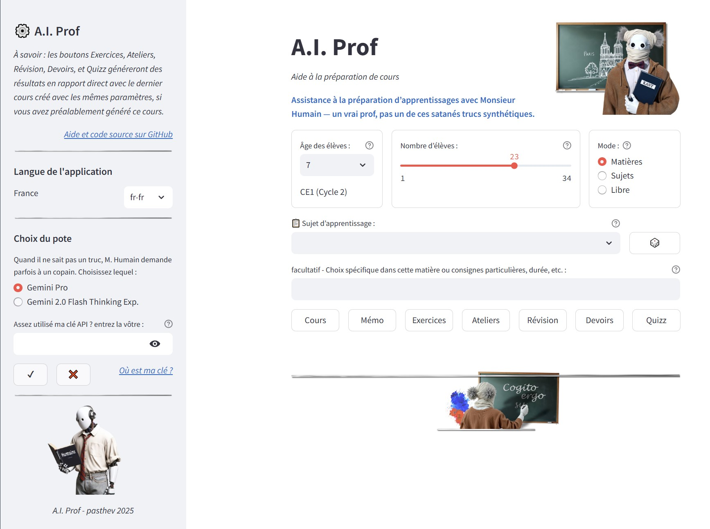
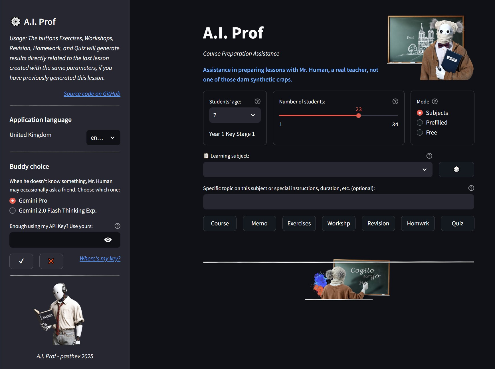
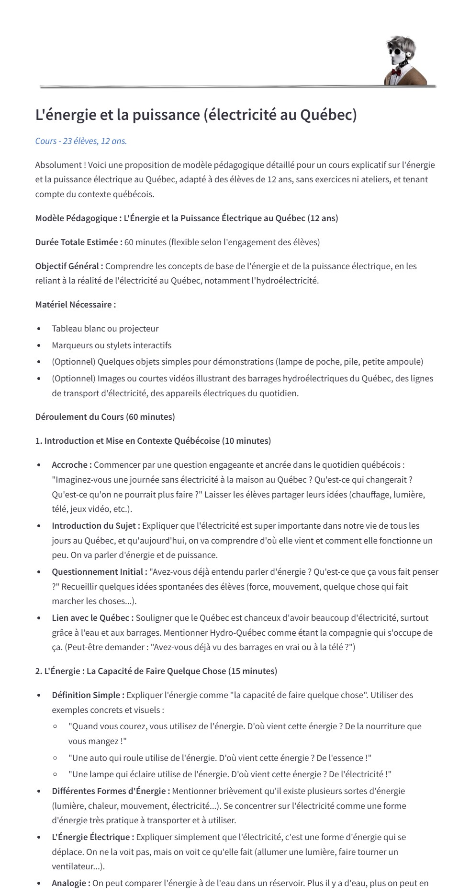
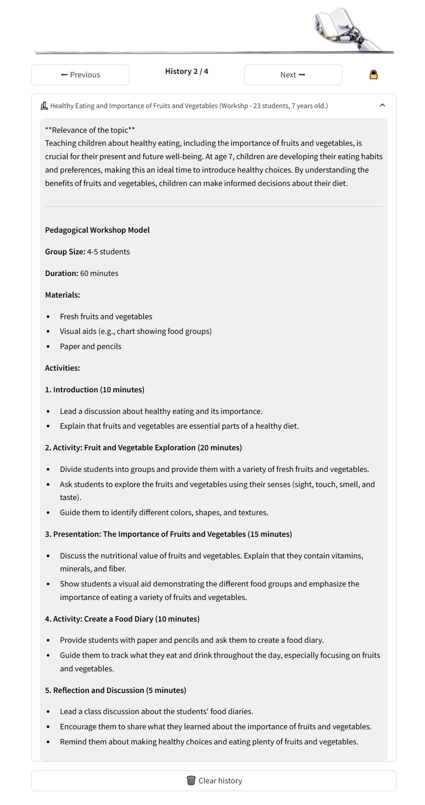

# A.I. Prof - Votre Assistant d'Enseignement Intelligent

[Click here for English](README_EN.md)


[](https://aiprof-pasthev.streamlit.app/)

**[Lien vers l'application en ligne](https://aiprof-pasthev.streamlit.app/)**

---

## Description de l'Application

**A.I. Prof** est une application Streamlit multilingue, actuellement disponible en français et en anglais, conçue pour assister les enseignants dans la création de matériel pédagogique engageant et personnalisé.  En utilisant la puissance des modèles d'intelligence artificielle de Gemini (Gemini Pro et Gemini 2.0 Flash Thinking Exp.),  **A.I. Prof** vous permet de générer rapidement et facilement une variété de ressources éducatives, adaptées à l'âge et au niveau de vos élèves, de 6 à 17 ans.

**Programmes scolaires préremplis et sujets aléatoires prédéfinis :**

*   **Programmes scolaires nationaux :** Les principales matières scolaires et spécialités des cycles supérieurs sont préremplies en fonction du pays et de la langue sélectionnés. Ces matières sont librement éditables en vue d'oublis ou de modifications futures.
*   **Sujets préremplis :** Des sujets préremplis et personnalisés par pays et par tranche d'âge sont disponibles, ainsi qu'un bouton de choix aléatoire pour générer un cours instantané.
*   **Langue et culture localisées :**  **A.I. Prof** génère des *prompts* qui distinguent le français québecois du français de France, l'anglais britannique de l'anglais états-unien, et s'adapte de son mieux aux subtilités culturelles.

**Fonctionnalités Principales :**

*   **Génération de Cours Détaillés :** Obtenez des propositions de cours structurées et complètes sur le sujet de votre choix.
*   **Création d'Exercices et de Travaux Pratiques :**  Générez des listes d'exercices variés et des idées de travaux pratiques pour consolider les apprentissages.
*   **Proposition de Plans de Révision :** Facilitez la préparation aux examens avec des plans de révision efficaces et pertinents.
*   **Conception de Devoirs à la Maison :**  Attribuez des devoirs pertinents et stimulants pour prolonger l'apprentissage en dehors de la salle de classe.
*   **Génération de Quiz Rapides :** Évaluez rapidement la compréhension de vos élèves avec des quiz concis et ciblés.
*   **Rédaction de Mémos et Aide-Mémoires :**  Créez des supports de synthèse pour aider vos élèves à retenir les points clés.

**Flexibilité et Personnalisation :**

*   **Choix du Modèle de Langage :** Sélectionnez le modèle Gemini le plus adapté à vos besoins entre Gemini Pro (modèle de base) et Gemini 2.0 Flash Thinking Exp. (modèle avancé).
*   **Adaptation à l'Âge et au Nombre d'Élèves :**  Spécifiez l'âge et le nombre d'élèves pour adapter le contenu généré à votre classe, et optimiser la gestion d'ateliers en sous-groupes.
*   **Modes de Sujets Multiples :**
    *   **Sujets Spécifiques :** Choisissez parmi une liste pré-définie de sujets pertinents et localisés pour différents niveaux scolaires.
    *   **Disciplines Scolaires :** Sélectionnez une matière générale nationale et laissez l'IA vous proposer des sujets associés, ou sélectionnez vous-même un thème à aborder dans cette discipline.
    *   **Mode Libre :**  Entrez n'importe quel sujet d'apprentissage de votre choix pour une génération de contenu totalement personnalisée.
*   **Instructions Spéciales :**  Ajoutez des instructions spécifiques pour affiner le contenu généré (par exemple, demander un ton particulier, une durée spécifique, etc.).
*   **Support Multilingue :** L'application est conçue pour être facilement adaptable à différentes langues (en fonction des fichiers de configuration JSON disponibles).
*   **Thèmes :**  **A.I. Prof** s'adapte aux modes clair ou sombres proposés par Streamlit.

---

## Aperçu de l'Interface Utilisateur


[](https://aiprof-pasthev.streamlit.app/)

[](https://aiprof-pasthev.streamlit.app/)


---

## Comment Utiliser A.I. Prof

L'utilisation d' **A.I. Prof** est simple et intuitive :

1.  **Sélectionnez la Langue de l'Interface :**  Choisissez la langue de votre choix dans le menu déroulant de la barre latérale.
2.  **Choisissez un Modèle de Langage :**  Sélectionnez le modèle Gemini que vous souhaitez utiliser (Gemini Pro ou Gemini 2.0 Flash Thinking Exp.) dans la barre latérale.
3.  **Clé API Gemini :**
    *   Si vous ne saisissez pas de clé API utilisateur ou n'en avez pas déjà définie dans votre système, l'application utilisera une clé API par défaut (susceptible de saturer si trop de demandes sont faites en simultané).
    *   Pour pallier ce problème, vous pouvez fournir votre clé API personnelle dans le champ prévu à cet effet dans la barre latérale. Cette clé sera stockée temporairement pendant la durée de votre session. Des boutons "✔" et "❌" sont disponibles pour valider ou annuler votre clé API utilisateur.
    *   Pour plus de souplesse, vous pouvez enregistrer votre clé d'API Gemini personnelle dans vos variable d'environnement `GEMINI_API_KEY`).
    *   Vous pouvez facilement et gratuitement obtenir votre propre clé d'API Gemini sur le [site Google AI Studio](https://aistudio.google.com/app/apikey). Si vous souhaitez enregistrer cette clé sur votre système pour ne pas avoir à la saisir à chaque utilisation, cette [page d'aide AI Studio](https://ai.google.dev/gemini-api/docs/api-key) vous explique la manipulation à effectuer.
4.  **Paramétrez votre Demande :**
    *   **Âge des élèves :**  Sélectionnez l'âge approximatif de vos élèves à l'aide du menu déroulant.
    *   **Nombre d'élèves :** Ajustez le curseur pour indiquer le nombre d'élèves concernés.
    *   **Mode de sujet :** Choisissez entre "Sujets Spécifiques", "Disciplines Scolaires" ou "Mode Libre" via les boutons radio.
    *   **Sujet d'apprentissage :**
        *   **Sujets Spécifiques/Disciplines Scolaires :** Sélectionnez un sujet dans la liste déroulante proposée (la liste varie en fonction du mode et de l'âge). Vous pouvez utiliser le bouton "🎲" pour obtenir une suggestion de sujet aléatoire.
        *   **Mode Libre :** Saisissez directement le sujet de votre choix dans le champ de texte libre.
    *   **Instructions Spéciales (optionnel) :** Si vous le souhaitez, entrez des instructions spécifiques pour affiner la génération de contenu (par exemple, "Rendre le texte concis", "Utiliser un ton formel", etc.).
5.  **Générez du Contenu :** Cliquez sur l'un des boutons d'action disponibles (Cours, Exercices, Travaux Pratiques, Révision, Devoirs, Quiz, Mémo) pour générer le type de contenu pédagogique souhaité. 
    
	**À savoir** : Si vous commencez par générer un cours sur un sujet de votre choix, les boutons Exercices, Ateliers, Révision, Devoirs, et Quizz généreront des contenus en rapport direct avec ce cours, pourvu qu'il ait été créé avec les mêmes paramètres d'âge et de nombre d'élèves, **A.I. Prof** recherchant automatiquement dans l'historique le dernier cours généré avec les mêmes paramètres. Si aucun cours n'a été préalablement généré, ces boutons génèreront des exercices aléatoires dans la matière choisie.
6.  **Consultez la Réponse :**  La réponse générée par l'IA s'affichera en dessous des boutons.
7.  **Naviguez dans l'Historique (si applicable) :** Si vous avez généré plusieurs contenus, vous pouvez naviguer dans l'historique des réponses à l'aide des boutons "Précédent" et "Suivant". Vous pouvez également verrouiller/déverrouiller l'affichage de l'historique via le bouton "🔒/🔓".

**Important :**

*   **Avertissement sur les Inexactitudes :**  Les réponses générées par l'IA peuvent parfois contenir des inexactitudes. Il est important de toujours vérifier et adapter le contenu généré avant de l'utiliser en contexte pédagogique.

---

## Aperçu des résultats proposés


[](https://aiprof-pasthev.streamlit.app/)

[](https://aiprof-pasthev.streamlit.app/)


---

## Prérequis et Installation (pour les développeurs)

Si vous souhaitez exécuter ou modifier l'application localement :

1.  **Cloner le dépôt GitHub :**
    ```bash
    git clone [URL_DU_DEPOT_GITHUB]
    cd AIProf
    ```
2.  **Installer les dépendances Python :**
    ```bash
    pip install -r requirements.txt
    ```
3.  **Configurer votre clé API Gemini :**
    *   **Option 1 :** Définir la variable d'environnement `GEMINI_API_KEY` avec votre clé API.
    *   **Option 2 :** Créer un fichier `.streamlit/secrets.toml` dans le répertoire de l'application et y ajouter votre clé API :
        ```toml
        API_KEY = "VOTRE_CLE_API_GEMINI_ICI"
        ```
4.  **Exécuter l'application Streamlit :**
    ```bash
    streamlit run aiprof.py
    ```

---

## Crédits et Remerciements

Application développée par Pascal Theveny.

[](https://github.com/pasthev/AIProf)

---

