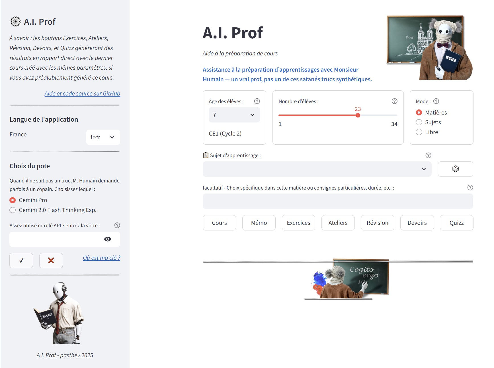
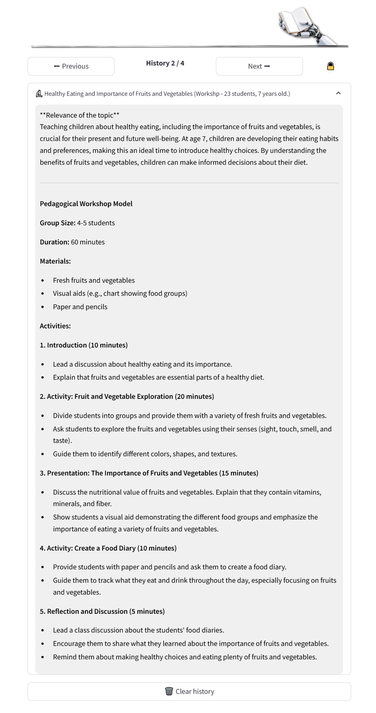

# A.I. Prof - Your Intelligent Teaching Assistant

[Click here for French](README.md)

[](https://aiprof-pasthev.streamlit.app/)

**[Link to the online application](https://aiprof-pasthev.streamlit.app/)**

---

## Application Description

**A.I. Prof** is a multilingual Streamlit application, currently available in French and English, designed to assist teachers in creating engaging and personalized educational materials. By harnessing the power of Gemini's artificial intelligence models (Gemini Pro and Gemini 2.0 Flash Thinking Exp.), **A.I. Prof** allows you to quickly and easily generate a variety of educational resources, tailored to the age and level of your students, from 6 to 17 years old.

**Pre-filled School Curricula and Predefined Random Topics:**

*   **National School Curricula:** The main school subjects and higher education specializations are pre-filled based on the selected country and language. These subjects are freely editable in case of omissions or future modifications.
*   **Pre-filled Topics:** Pre-filled and personalized topics by country and age group are available, as well as a random choice button to generate an instant lesson.
*   **Localized Language and Culture:**  **A.I. Prof** generates *prompts* that distinguish between Quebec French and French from France, British English and American English, and adapts as best as possible to cultural subtleties.

**Main Features:**

*   **Detailed Lesson Generation:** Get structured and comprehensive lesson proposals on the topic of your choice.
*   **Creation of Exercises and Practical Work:** Generate lists of varied exercises and practical work ideas to reinforce learning.
*   **Revision Plan Proposals:** Facilitate exam preparation with effective and relevant revision plans.
*   **Homework Design:** Assign relevant and stimulating homework to extend learning outside the classroom.
*   **Quick Quiz Generation:** Quickly assess your students' understanding with concise and targeted quizzes.
*   **Memo and Cheat Sheet Writing:** Create summary materials to help your students remember key points.

**Flexibility and Personalization:**

*   **Language Model Choice:** Select the Gemini model best suited to your needs between Gemini Pro (basic model) and Gemini 2.0 Flash Thinking Exp. (advanced model).
*   **Adaptation to Age and Number of Students:** Specify the age and number of students to adapt the generated content to your class, and optimize the management of subgroup workshops.
*   **Multiple Subject Modes:**
    *   **Specific Topics:** Choose from a predefined list of relevant and localized topics for different school levels.
    *   **School Disciplines:** Select a general national subject and let the AI ​​suggest associated topics, or select a theme yourself to address within this discipline.
    *   **Free Mode:** Enter any learning topic of your choice for completely personalized content generation.
*   **Special Instructions:** Add specific instructions to refine the generated content (for example, request a particular tone, a specific duration, etc.).
*   **Multilingual Support:** The application is designed to be easily adaptable to different languages ​​(depending on the available JSON configuration files).
*   **Themes:** **A.I. Prof** adapts to light or dark modes offered by Streamlit.

---

## User Interface Overview

[](https://aiprof-pasthev.streamlit.app/)

[](https://aiprof-pasthev.streamlit.app/)

---

## How to Use A.I. Prof

Using **A.I. Prof** is simple and intuitive:

1.  **Select the Interface Language:** Choose your preferred language from the sidebar dropdown menu.
2.  **Choose a Language Model:** Select the Gemini model you want to use (Gemini Pro or Gemini 2.0 Flash Thinking Exp.) in the sidebar.
3.  **Gemini API Key:**
    *   If you do not enter a user API key or do not already have one defined in your system, the application will use a default API key (likely to become saturated if too many simultaneous requests are made).
    *   To overcome this problem, you can provide your personal API key in the field provided for this purpose in the sidebar. This key will be stored temporarily for the duration of your session. "✔" and "❌" buttons are available to validate or cancel your user API key.
    *   For more flexibility, you can save your personal Gemini API key in your `GEMINI_API_KEY` environment variable.
    *   You can easily and freely obtain your own Gemini API key on the [Google AI Studio website](https://aistudio.google.com/app/apikey). If you want to save this key on your system so you don't have to enter it each time, this [AI Studio help page](https://ai.google.dev/gemini-api/docs/api-key) explains how to do it.
4.  **Set up your Request:**
    *   **Student Age:** Select the approximate age of your students using the dropdown menu.
    *   **Number of Students:** Adjust the slider to indicate the number of students involved.
    *   **Subject Mode:** Choose between "Specific Topics", "School Disciplines" or "Free Mode" via the radio buttons.
    *   **Learning Topic:**
        *   **Specific Topics/School Disciplines:** Select a topic from the proposed dropdown list (the list varies depending on the mode and age). You can use the "🎲" button to get a random topic suggestion.
        *   **Free Mode:** Enter the topic of your choice directly in the free text field.
    *   **Special Instructions (optional):** If you wish, enter specific instructions to refine the content generation (for example, "Make the text concise", "Use a formal tone", etc.).
5.  **Generate Content:** Click on one of the available action buttons (Lesson, Exercises, Practical Work, Revision, Homework, Quiz, Memo) to generate the desired type of educational content.

    **Good to know**: If you start by generating a lesson on a topic of your choice, the Exercises, Workshops, Revision, Homework, and Quiz buttons will generate content directly related to this lesson, provided it was created with the same age and number of students parameters, **A.I. Prof** automatically searching the history for the last lesson generated with the same parameters. If no lesson has been previously generated, these buttons will generate random exercises in the chosen subject.
6.  **Consult the Response:** The response generated by the AI ​​will be displayed below the buttons.
7.  **Navigate History (if applicable):** If you have generated multiple content items, you can navigate through the response history using the "Previous" and "Next" buttons. You can also lock/unlock the display of history via the "🔒/🔓" button.

**Important:**

*   **Warning about Inaccuracies:** The responses generated by the AI ​​may sometimes contain inaccuracies. It is important to always verify and adapt the generated content before using it in a teaching context.

---

## Overview of Proposed Results

[](https://aiprof-pasthev.streamlit.app/)

[](https://aiprof-pasthev.streamlit.app/)

---

## Prerequisites and Installation (for developers)

If you want to run or modify the application locally:

1.  **Clone the GitHub repository:**
    ```bash
    git clone [URL_DU_DEPOT_GITHUB]
    cd AIProf
    ```
2.  **Install Python dependencies:**
    ```bash
    pip install -r requirements.txt
    ```
3.  **Configure your Gemini API key:**
    *   **Option 1:** Define the `GEMINI_API_KEY` environment variable with your API key.
    *   **Option 2:** Create a `.streamlit/secrets.toml` file in the application directory and add your API key to it:
        ```toml
        API_KEY = "YOUR_GEMINI_API_KEY_HERE"
        ```
4.  **Run the Streamlit application:**
    ```bash
    streamlit run aiprof.py
    ```

---

## Credits and Acknowledgements

Application developed by Pascal Theveny.

[](https://github.com/pasthev/AIProf)

---